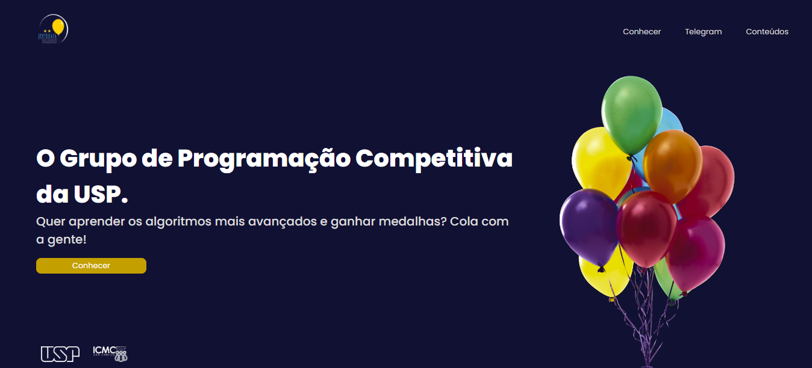
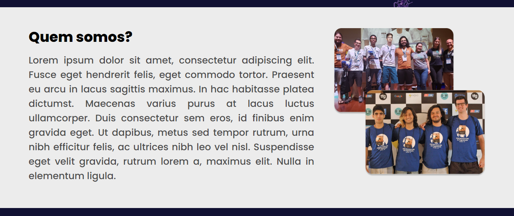
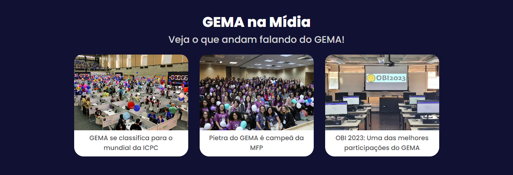
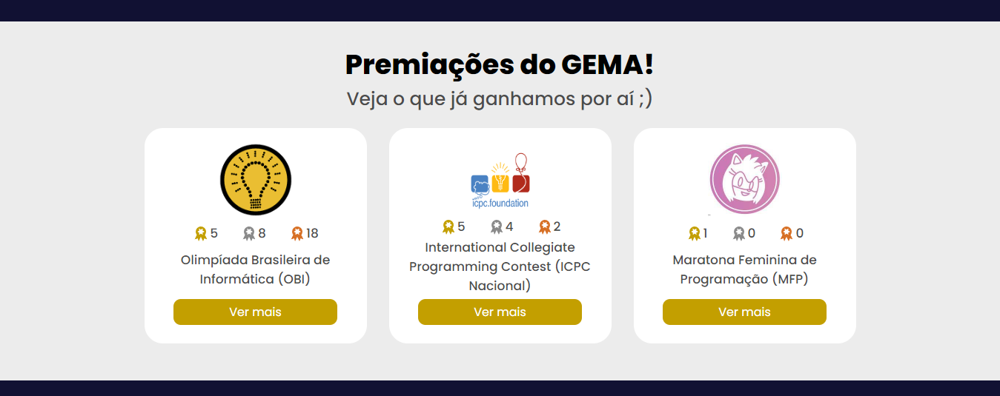
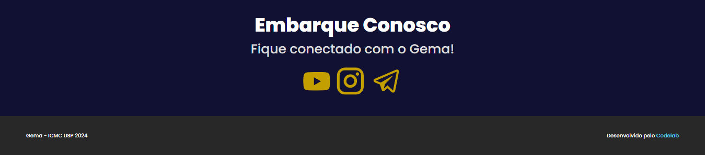
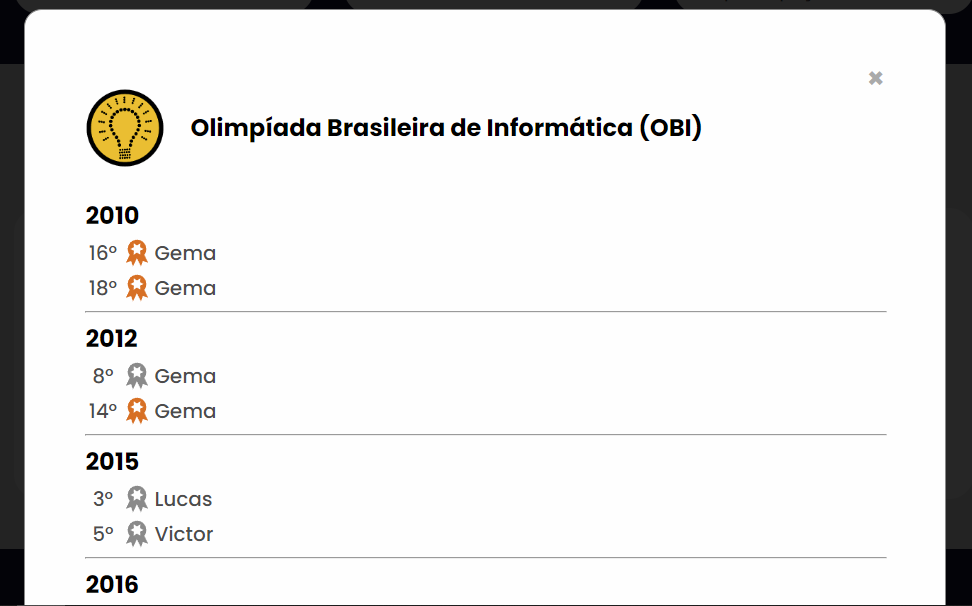

# Landing Page - GEMA
Projeto para o dev.learn() do CodeLab Sanca da USP São Carlos.
Consiste em uma landing page para o GEMA (Grupo de Extensão de Maratona de Programção).

## Tecnologias
- HTML
- CSS
- Javascript

## Imagens

